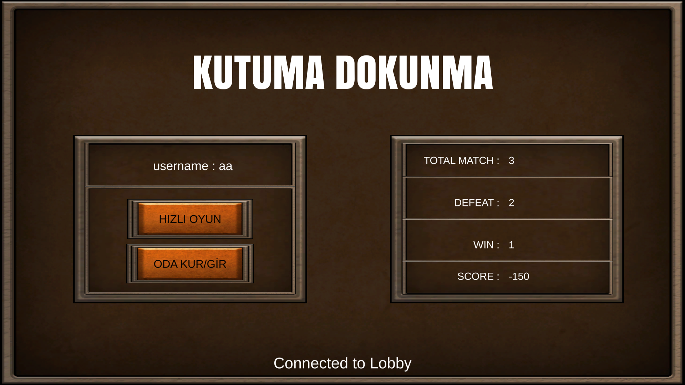

# Kutuma Dokunma

**Kutuma Dokunma**, **Unity** ve **Photon** kullanılarak geliştirilmiş 2 kişilik bir çevrimiçi çok oyunculu oyundur. Oyunda, oyuncular bir **top güllesi** objesini kontrol eder ve arenanın ortasındaki kutuları devirmeye çalışır. Kutuları vurduktan sonra rakiplerini vuran oyuncu oyunu kazanır.

## Özellikler
- **Çok Oyunculu Oynanış**: İki oyuncu çevrimiçi olarak bağlanıp rekabet edebilir.
- **Basit Kontroller**: Oyun, **Space** tuşu ile top güllelerini ateşleyerek oynanır.
- **Photon Entegrasyonu**: Oyun, gerçek zamanlı çok oyunculu özellikler için **Photon** kullanır.

## Nasıl Oynanır
1. **Oyunu Başlatın**: Her iki oyuncu da oyunu çalıştırmalı ve Photon üzerinden bağlanmalı.
2. **Amaç**: Ortadaki kutuları devirin, ardından rakibinizi vurun.
3. **Kontroller**: **Space** tuşuna basarak top gülleyi fırlatabilirsiniz.
4. **Kazanan**: Kutuları devirdikten sonra rakibini vuran oyuncu raundu kazanır.

## Kurulum Talimatları

### Gerekli Programlar
- Unity 2021.x veya üzeri.
- Photon PUN 2 yüklü (Unity Asset Store'dan indirilebilir).
- Çok oyunculu işlevler için internet bağlantısı.

## Oyun İçi Görüntüler

